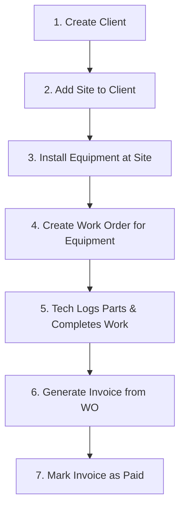

# Codos-ERP: Step-by-Step User Guide

Codos-ERP is a Field Service Management (FSM) application designed to track everything from the moment a client signs up to the moment they pay their invoice for a repair. 

Because the data is highly relational, there is a specific flow you should follow to use the system effectively.

---

## Step 1: Onboard a Client (The Foundation)
Before you can repair a machine or send an invoice, you need a Client.
1. Navigate to **Clients** in the sidebar.
2. Click **+ Add Client** and fill in their basic business details (e.g., "Salon Oski").
3. Once created, click the **Eye Icon** to open the Client Dashboard. 
4. **Add Contacts:** Add the people who work there (e.g., Managers, Owners).
5. **Add Sites:** Add the physical locations where work will be performed (e.g., "Colombo Main Branch"). 

> [!IMPORTANT]  
> You *must* create at least one Site for a client before you can assign Equipment or Work Orders to them.

---

## Step 2: Register Assets & Equipment
Now that you have a Client and a Site, you can register the machines you will be maintaining.
1. Navigate to **Assets & Equipment**.
2. Click **+ Add Equipment**.
3. **The Cascade:** Select the Client ("Salon Oski"). Notice how the "Site" dropdown automatically updates to only show sites belonging to Salon Oski. Select the site.
4. Enter the machine details (e.g., "Haircut Machine", Model "A4000", Serial Number "12345").
5. Once saved, you can click the **Eye Icon** to view the equipment's history and log routine maintenance records.

---

## Step 3: Dispatching a Work Order (Operations)
When a client calls because a machine is broken, you create a Work Order.
1. Navigate to **Work Orders**.
2. Click **+ New Work Order**.
3. **Smart Routing:**
   - Select the Client.
   - Select the Site where the issue is happening.
   - Select the specific Equipment that is broken (the dropdown will only show equipment installed at that specific site).
4. Assign the Work Order to a Technician (a User in your system) and set the priority (e.g., EMERGENCY).

---

## Step 4: Executing the Work Order (The Technician View)
The technician arrives on-site and opens the Work Order on their tablet or laptop.
1. They open the Work Order and change the status from **ASSIGNED** to **IN PROGRESS**.
2. **Tasks:** They can add a checklist of tasks (e.g., "Inspect Motor", "Replace Belt") and check them off as they go.
3. **Parts Used:** If they use inventory during the repair (e.g., they used 1x Drive Belt that costs $45), they add it to the Parts List.
4. **Completion:** They write final "Resolution Notes" describing the fix, and change the status to **COMPLETED**.

---

## Step 5: Billing and Invoicing
Once a Work Order is marked as COMPLETED, it's time to get paid.
1. Open the completed Work Order.
2. You will see a green **Invoice** button appear at the top. Click it.
3. The system automatically generates a Draft Invoice and pulls in all the Parts the technician used, calculating the costs automatically.
4. **Adjustments:** You can manually add extra line items, like a "Labor Fee" or "Emergency Callout Fee". The subtotal, tax, and totals will calculate automatically.
5. **Delivery:** Click **Print / PDF** to generate a clean, distraction-free document that you can save as a PDF and email to the client.
6. Change the invoice status to **SENT**, and eventually **PAID** once the check clears!

---

### Summary Workflow Diagram

